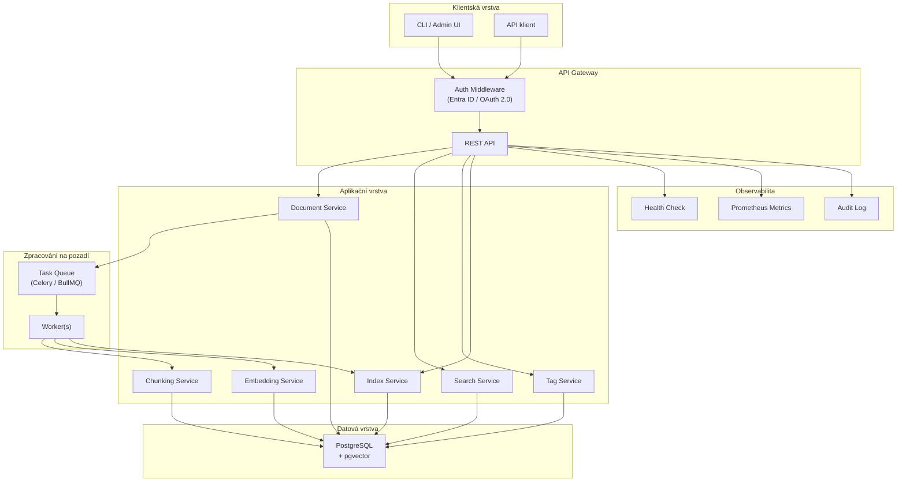
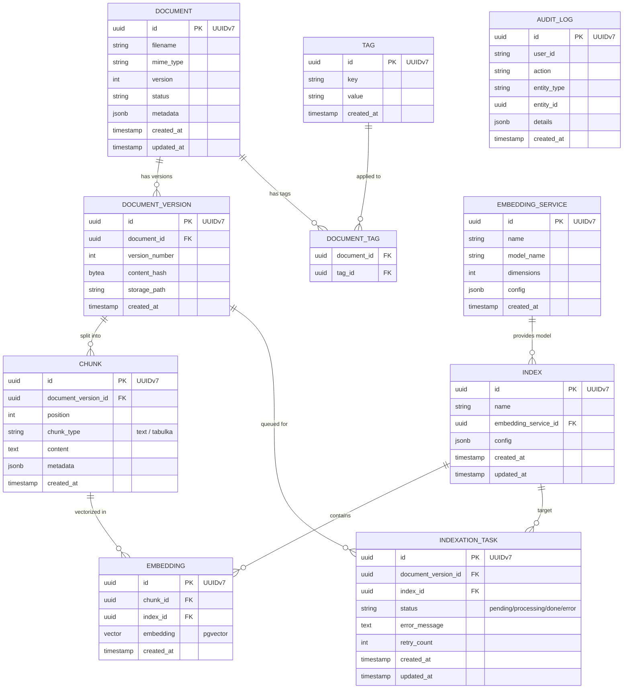
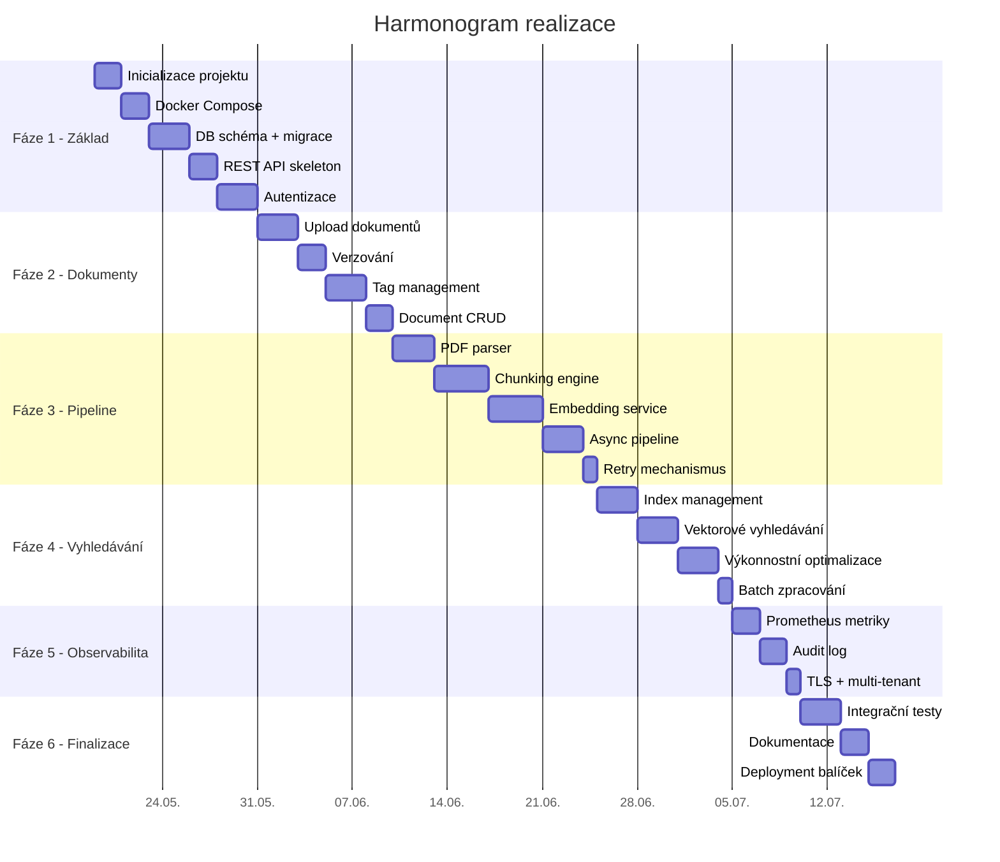

# Analýza a plán realizace: Sémantický index dokumentů

## 1. Přepis zadání z fotografií

> [!NOTE]
> Text byl extrahován z 3 JPEG fotografií tištěné technické specifikace. Některé části na okrajích/přeloženém papíru byly částečně nečitelné – tyto jsou označeny `[?]`.

---

### Úvod

Cílem veřejné zakázky je **návrh, implementace a dodání systému pro tvorbu a provoz sémantického indexu dokumentů**, který umožní efektivní vyhledávání informací na základě významové (vektorové) podobnosti.

Navrhované řešení musí umožnit:
- zpracování nestrukturovaných dokumentů (zejména ve formátu PDF)
- jejich transformaci do strukturované podoby
- vytvoření vektorových reprezentací (embeddingů)
- uložení do indexu umožňujícího rychlé a přesné vyhledávání

**Důraz je kladen zejména na:**
- technologickou nezávislost a eliminaci vendor lock-in
- využití otevřených standardů a open-source technologií
- možnost provozu v prostředí zadavatele bez závislosti na externích službách
- modularitu a rozšiřitelnost řešení
- transparentnost, auditovatelnost a dlouhodobou udržitelnost

Systém bude sloužit jako **obecná platforma pro sémantické vyhledávání** nad dokumenty a musí být navržen tak, aby umožňoval budoucí rozšiřování o další typy vstupních dat, embeddingových modelů a způsobů zpracování.

Dodavatel je povinen navrhnout řešení v souladu s touto technickou specifikací a dodat plně funkční systém včetně zdrojových kódů, dokumentace a podpory jeho nasazení a provozu v infrastruktuře zadavatele.

---

### Obecné podmínky

Řešení:
- není závislé na licenční politice dodavatelů jednotlivých subkomponent
- je realizováno výhradně s využitím open-source technologií licencovaných pod permisivní licencí (např. MIT, Apache 2.0, BSD) nebo jinou licencí umožňující komerční využití bez povinnosti otevření odvozeného díla
- nevyužívá proprietární rozšíření nebo uložené procedury vázané na konkrétního dodavatele AI služeb
- je modulární a umožňuje oddělení jednotlivých komponent (chunkování, embedding, indexace)

---

### §1. Datové úložiště a perzistence

- Uložené entity používají jako primární klíč **UUID (preferovaně UUIDv7)**
- Primární datové úložiště:
  - je realizováno pomocí **PostgreSQL**
  - využívá rozšíření **`pgvector`** přímo pro ukládání a vyhledávání embeddingů
  - podporuje ukládání vektorových dat a podobnostní vyhledávání
  - umožňuje plnou přenositelnost dat (dokumenty, chunky, embeddingy, metadata, tagy, indexy) mezi instancemi databáze bez ztráty informace

---

### §2. Zpracování dokumentů

Výsledné řešení:
- je distribuováno (např. jako docker kontejnery)
- je konfigurovatelné
- nevyžaduje trvalé připojení pro lokální provoz služby
- podporuje horizontální škálování jednotlivých komponent

---

### §3. Embeddingovací služby

Embeddingové služby jsou plně konfigurovatelné za běhu služby a splňují následující požadavky:
- systém podporuje integraci s více embeddingovými modely současně
- podporuje výměnu embeddingových modelů bez nutnosti úpravy zdrojového kódu
- možnost využití jiných kompatibilních embeddingovacích služeb
- konfigurace embeddingovací služby zahrnuje minimálně:
  - identifikaci API endpointu a modelu
  - dimenzi embeddingů (např. 1536 pro OpenAI text-embedding-3-small, 768 pro open-source)
- systém umožňuje využití více embeddingovacích služeb
- jedna embeddingovací služba může být využita více indexy současně
- změna nebo přidání embeddingovací služby nevyžaduje rekompilaci aplikace
- systém uchovává původní dokument po celou dobu jeho životního cyklu
- umožňuje plnou reindexaci dokumentů při změně nebo přidání nového embedding modelu

---

### §4. Chunkovací služby

Chunkovací služby jsou plně konfigurovatelné.

Součástí dodávky je minimálně implementace služby pro zpracování PDF dokumentů, realizovaná jako kontejner, která:
- provádí extrakci souvislého textu
- provádí extrakci tabulek a jejich uložení ve strukturovaném formátu (např. Markdown, HTML)
- umožňuje konfiguraci překryvu (overlap) a maximální délky chunku
- podporuje chunkování podle stránek, odstavců atd.
- vrací textovou nebo strukturovanou reprezentaci nalezeného chunku včetně metadat:
  - identifikátor zdrojového dokumentu
  - pozici v dokumentu (např. číslo stránky nebo rozsah)
  - typ chunku (text / tabulka)

---

### §5. Dokumenty, tagy a metadata

**Indexovatelné dokumenty:**
- jsou označitelné pomocí tagů (key–value)
- sada tagů je globální v rámci celé služby
- každý dokument může mít přiřazeno 0 až N tagů
- změna tagů dokumentu nevyžaduje reindexaci embeddingů
- změna tagů se projeví okamžitě ve vyhledávání

**Systém:**
- podporuje verzování dokumentů
- umožňuje evidenci více verzí jednoho dokumentu
- umožňuje indexaci konkrétní verze dokumentu

---

### §6. Indexy

Systém podporuje více indexů nad dokumenty.

**Index:**
- reprezentuje konkrétní množinu embeddingů nad chunkovanými dokumenty
- je jednoznačně identifikován
- je svázán právě s jednou embeddingovou službou
- umožňuje indexaci jednoho dokumentu do více indexů současně
- může být vytvořen, upraven nebo odstraněn za běhu služby
- změna konfigurace jednoho indexu neovlivňuje ostatní indexy

**Systém:**
- umožňuje odstranění indexu včetně všech jeho embeddingů
- zajišťuje konzistenci dat při mazání dokumentů nebo indexů

---

### §7. Asynchronní zpracování

**Indexace dokumentů:**
- probíhá asynchronně
- umožňuje sledování stavu zpracování (např. čeká / zpracovává se / dokončeno / chyba)
- podporuje paralelní zpracování více dokumentů
- umožňuje opakování zpracování v případě chyby

---

### §8. API rozhraní

Služby jsou realizovány prostřednictvím REST API a poskytují OpenAPI specifikaci.
API:
- je verzováno (např. `/api/v1/...`)
- používá standardizovaný formát chybových odpovědí
- podporuje idempotentní operace tam, kde je to relevantní

**8.1 Vložení dokumentu do indexu**
Endpoint umožňuje:
- nahrání dokumentu ve formátu PDF
- vložení tagů dokumentu
- určení seznamu indexů, do kterých bude dokument zaindexován
Zpracování probíhá asynchronně. Odpověď obsahuje minimálně identifikátor dokumentu a identifikátor úlohy zpracování.

**8.2 Přehledová rozhraní**
Systém poskytuje endpointy pro listování/zobrazení evidovaných dokumentů.

**8.3 Sémantické vyhledávání**
Vstupní parametry vyhledávání:
- hledaná fráze
- filtry nad tagy (podpora logických operátorů AND / OR / NOT)
- seznam indexů, které budou prohledávány
- požadovaný počet výsledků (k) a dolní hranice podobnosti

Odpověď obsahuje identifikátor dokumentu a textovou nebo strukturovanou reprezentaci nalezeného chunku.

---

### §9. Výkonnostní požadavky

**Systém:**
- podporuje paralelní zpracování dotazů
- umožňuje horizontální škálování
- je schopen obsloužit více souběžných požadavků

**Požadavky:**
- maximální odezva vyhledávání je definovatelná (např. do 2 sekund pro standardní dotaz)
- systém umožňuje dávkové (batch) zpracování embeddingů

---

### §10. Monitoring a audit

**Systém poskytuje:**
- health check endpoint
- metriky pro monitoring (např. Prometheus kompatibilní)
- logování operací (indexace, vyhledávání, chyby)

**Systém:**
- umožňuje audit operací (kdo a kdy provedl akci)

---

### §11. Autentizace a zabezpečení

**Autentizace služby:**
- je realizována pomocí **Microsoft Entra ID**
- je postavena na standardech **OAuth 2.0 / OpenID Connect**
- umožňuje budoucí rozšíření o autorizační model založený na rolích nebo scopech

**Systém:**
- podporuje šifrování dat při přenosu (TLS)
- umožňuje implementaci izolace dat (např. multi-tenant režim)

---

### §12. Implementace

**Implementace řešení:**
- je realizována v jednom z jazyků: **C#**, **Python** nebo **JavaScript**
- nevyužívá proprietární runtime závislé na konkrétním cloudu
- je plně provozovatelná v infrastruktuře zadavatele

---

### §13. Akceptační kritéria

Zadavatel ověří zejména:
- možnost indexace jednoho dokumentu do více indexů s různými embeddingovými modely
- možnost změny embeddingovací služby bez změny aplikačního kódu
- možnost plné reindexace dokumentů
- funkčnost filtrování výsledků pomocí tagů
- podporu hybridního vyhledávání
- možnost provozu řešení v prostředí bez přímého přístupu k internetu
- správnou funkci asynchronního zpracování

---

### §14. Provoz a údržba

Systém:
- umožňuje zálohování a obnovu dat
- podporuje disaster recovery scénáře
- obsahuje dokumentaci pro nasazení a provoz

---

### §15. Dokumentace

Součástí dodávky je:
- architektonická dokumentace
- dokumentace API (OpenAPI)
- dokumentace nasazení
- základní provozní dokumentace

---

### §16. Licenční a autorská práva

Zadavatel má právo používat dílo bez omezení a upravovat je pro vlastní potřeby. Součástí je i předání kompletních zdrojových kódů.

---

## 2. Klíčové požadavky – souhrn

| Oblast | Požadavek | Priorita |
|---|---|---|
| **Databáze** | PostgreSQL + pgvector, UUID v7 klíče | Kritická |
| **Dokumenty** | PDF vstup, chunkování (text/tabulka), verzování | Kritická |
| **Embeddingy** | Open-source modely, modulární výměna | Kritická |
| **Indexy** | Více indexů, CRUD za běhu, vazba na embedding službu | Kritická |
| **Vyhledávání** | Sémantické (vektorové), < 2s odezva | Kritická |
| **Tagy** | Key-value, globální sada, okamžité filtrování | Vysoká |
| **Asynchronní zpracování** | Fronta, stavy, retry, paralelismus | Vysoká |
| **API** | REST/gRPC, strukturované odpovědi | Kritická |
| **Autentizace** | Microsoft Entra ID, OAuth 2.0 / OIDC | Vysoká |
| **Monitoring** | Health check, Prometheus metriky, audit log | Střední |
| **Škálovatelnost** | Horizontální škálování, souběžnost | Střední |
| **Licence** | Výhradně open-source (MIT/Apache/BSD) | Kritická |
| **Nasazení** | On-premise v infra zadavatele, kontejnerizace | Vysoká |

---

## 3. Architektonický návrh



---

## 4. Volba technologického stacku

| Komponenta | Technologie | Licence | Odůvodnění |
|---|---|---|---|
| **Jazyk** | Python 3.12+ | PSF | Nejlepší ekosystém pro NLP/ML, specifikace povoluje |
| **Web framework** | FastAPI | MIT | Async, OpenAPI docs, vysoký výkon |
| **Databáze** | PostgreSQL 16 | PostgreSQL License | Požadavek specifikace |
| **Vektorové rozšíření** | pgvector | PostgreSQL License | Požadavek specifikace |
| **ORM** | SQLAlchemy 2.0 + asyncpg | MIT | Async podpora, pgvector integrace |
| **Task queue** | Celery + Redis | BSD | Asynchronní zpracování, retry, paralelismus |
| **PDF zpracování** | PyMuPDF (fitz) | AGPL→ **alternativa: pdfplumber (MIT)** | Extrakce textu i tabulek |
| **Chunkování** | LangChain text splitters nebo vlastní | MIT | Modulární, konfigurovatelné |
| **Embedding modely** | sentence-transformers (lokální) | Apache 2.0 | Bez vendor lock-in, on-premise |
| **Autentizace** | msal (Microsoft) + python-jose | MIT | Entra ID / OAuth 2.0 |
| **Monitoring** | prometheus-client | Apache 2.0 | Prometheus kompatibilní metriky |
| **Kontejnerizace** | Docker + docker-compose | Apache 2.0 | On-premise nasazení |
| **Migrace DB** | Alembic | MIT | Verzování DB schématu |

> [!WARNING]
> **PyMuPDF** má AGPL licenci – je nutné použít alternativu (pdfplumber, pypdf) nebo ověřit kompatibilitu s požadavky na licencování. Specifikace vyžaduje výhradně permisivní licence.

---

## 5. Datový model (PostgreSQL)



---

## 6. Fázovaný implementační plán

### Fáze 1: Základ (~ 2 týdny)
| # | Úkol | Detail |
|---|---|---|
| 1.1 | Inicializace projektu | Python projekt, pyproject.toml, struktura adresářů |
| 1.2 | Docker Compose | PostgreSQL + pgvector + Redis kontejnery |
| 1.3 | DB schéma + migrace | Alembic migrace, všechny tabulky dle datového modelu |
| 1.4 | Základní REST API | FastAPI skeleton, health check endpoint |
| 1.5 | Autentizace | Entra ID middleware (OAuth 2.0 / OIDC) |

### Fáze 2: Správa dokumentů (~ 2 týdny)
| # | Úkol | Detail |
|---|---|---|
| 2.1 | Upload dokumentů | Nahrání PDF, uložení, vytvoření záznamu |
| 2.2 | Verzování | Správa verzí dokumentů |
| 2.3 | Tag management | CRUD tagy, přiřazování k dokumentům |
| 2.4 | Document CRUD | Listování, detail, mazání s kaskádou |

### Fáze 3: Zpracování pipeline (~ 3 týdny)
| # | Úkol | Detail |
|---|---|---|
| 3.1 | PDF parser | Extrakce textu a tabulek z PDF |
| 3.2 | Chunking engine | Modulární chunkování, konfigurovatelné strategie |
| 3.3 | Embedding service | Abstrakce nad embedding modely, lokální inference |
| 3.4 | Asynchronní pipeline | Celery workers, task queue, sledování stavů |
| 3.5 | Retry mechanismus | Opakování při chybě, dead-letter queue |

### Fáze 4: Indexace a vyhledávání (~ 2 týdny)
| # | Úkol | Detail |
|---|---|---|
| 4.1 | Index management | CRUD indexů, vazba na embedding službu |
| 4.2 | Vektorové vyhledávání | pgvector podobnostní dotazy, filtrování dle tagů |
| 4.3 | Výkonnostní optimalizace | IVFFlat/HNSW indexy, query tuning, < 2s odezva |
| 4.4 | Batch zpracování | Dávkové generování embeddingů |

### Fáze 5: Observabilita a zabezpečení (~ 1 týden)
| # | Úkol | Detail |
|---|---|---|
| 5.1 | Prometheus metriky | Instrumentace klíčových operací |
| 5.2 | Audit log | Logování všech operací s identitou uživatele |
| 5.3 | TLS konfigurace | Šifrování přenosu |
| 5.4 | Multi-tenant izolace | Příprava na oddělení dat |

### Fáze 6: Finalizace (~ 1 týden)
| # | Úkol | Detail |
|---|---|---|
| 6.1 | Integrační testy | End-to-end testy celého pipeline |
| 6.2 | Dokumentace | API docs (OpenAPI), deployment guide, uživatelská příručka |
| 6.3 | Přenositelnost dat | Export/import dat mezi instancemi |
| 6.4 | Deployment balíček | Docker images, Helm chart / compose pro produkci |

---

## 7. Struktura projektu

```
semantic-index/
├── docker-compose.yml
├── Dockerfile
├── pyproject.toml
├── alembic/
│   ├── alembic.ini
│   └── versions/
├── src/
│   ├── main.py                  # FastAPI entrypoint
│   ├── config.py                # Konfigurace (env vars)
│   ├── auth/
│   │   ├── entra_id.py          # Microsoft Entra ID integration
│   │   └── middleware.py        # OAuth 2.0 middleware
│   ├── api/
│   │   ├── documents.py         # Document endpoints
│   │   ├── tags.py              # Tag endpoints
│   │   ├── indexes.py           # Index endpoints
│   │   ├── search.py            # Search endpoints
│   │   └── tasks.py             # Task status endpoints
│   ├── models/
│   │   ├── document.py
│   │   ├── chunk.py
│   │   ├── embedding.py
│   │   ├── index.py
│   │   ├── tag.py
│   │   └── audit.py
│   ├── services/
│   │   ├── document_service.py
│   │   ├── chunking/
│   │   │   ├── base.py          # Abstract chunker
│   │   │   ├── text_chunker.py
│   │   │   └── table_chunker.py
│   │   ├── embedding/
│   │   │   ├── base.py          # Abstract embedding provider
│   │   │   └── sentence_transformer.py
│   │   ├── index_service.py
│   │   ├── search_service.py
│   │   └── tag_service.py
│   ├── workers/
│   │   ├── celery_app.py
│   │   └── indexation_worker.py
│   └── monitoring/
│       ├── health.py
│       ├── metrics.py
│       └── audit.py
├── tests/
│   ├── unit/
│   └── integration/
└── docs/
    ├── api.md
    ├── deployment.md
    └── architecture.md
```

---

## 8. Rizika a otevřené otázky

| # | Riziko / Otázka | Dopad | Mitigace |
|---|---|---|---|
| 1 | **Podpora hybridního vyhledávání** (§13) | Kromě pgvector vektorového hledání se očekává i textové hledání (BM25 apod.) | Nasadit PostgreSQL Full-Text Search nebo dedikované řešení |
| 2 | **Volba embedding modelu** | Výkon vyhledávání závisí na kvalitě modelu, požadavek např. na dimenzi 1536/768 | Možnost integrace s OpenAI, i přes požadavek na lokální běh? Možnost použít Multilingual E5 pro lokální běh |
| 3 | **Velikost embeddingů vs. výkon pgvector** | U velkých datasetů může být pgvector pomalý | HNSW indexy, případně partition tabulek |
| 4 | **PDF s OCR / skenované dokumenty** | Nespecifikováno, zda vstupem mohou být i skenované PDF | Připravit OCR modul jako volitelný |
| 5 | **Licenční audit** | Nutná důkladná kontrola všech závislostí (viz např. PyMuPDF) | Automatický license-check v CI/CD |

---

## 9. Odhadovaný harmonogram



**Celkový odhad: ~11 týdnů** (při jednom vývojáři na plný úvazek)
